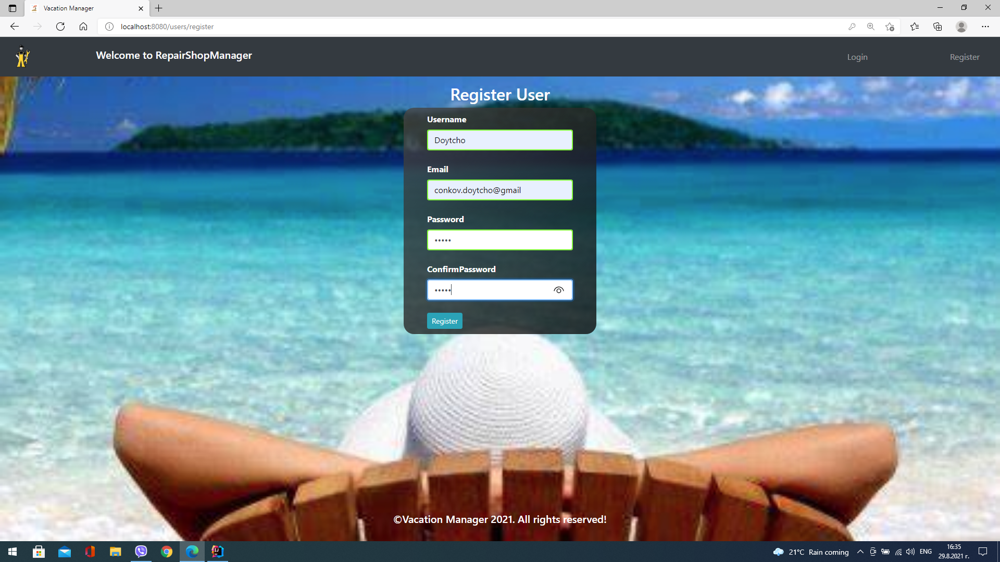
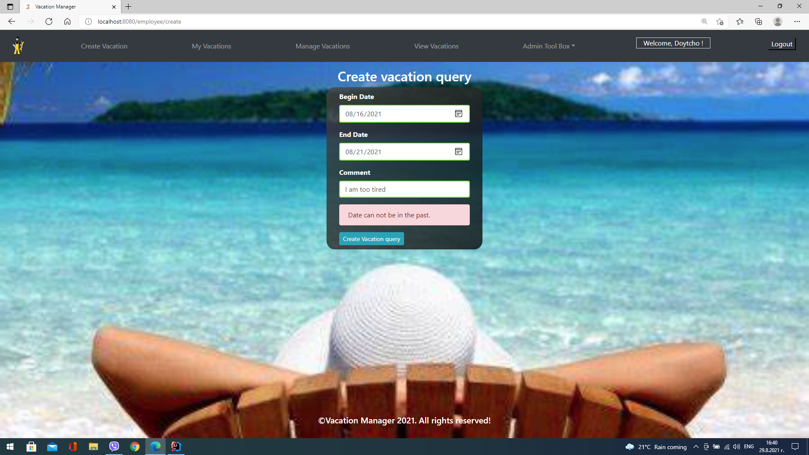
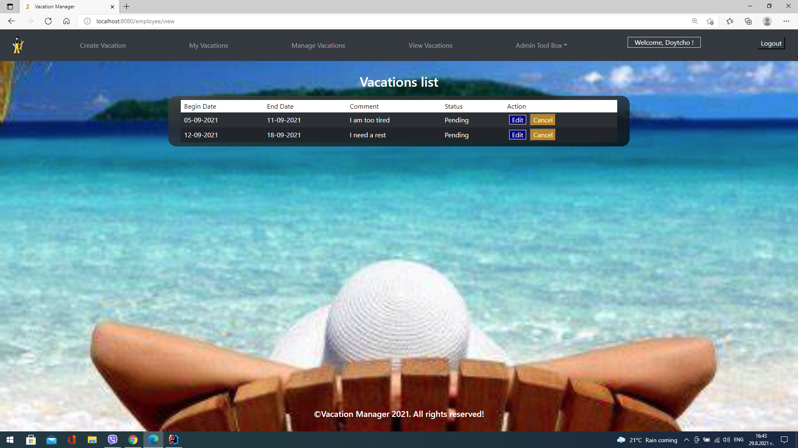
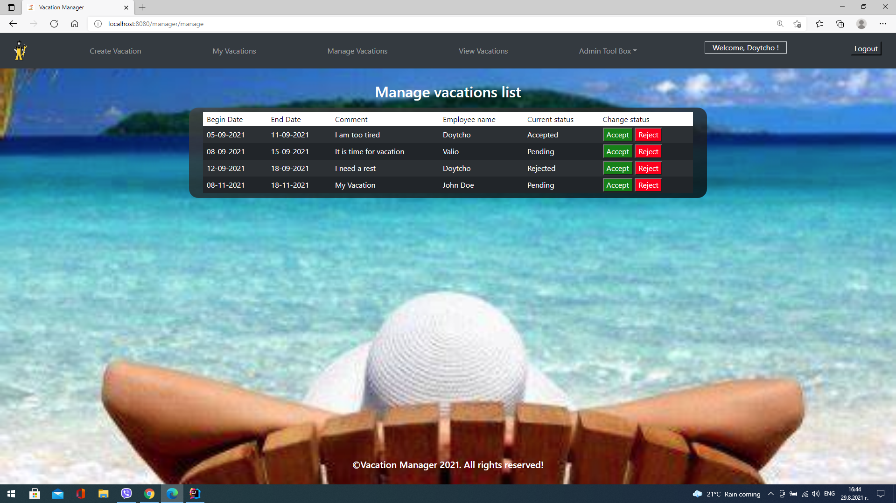
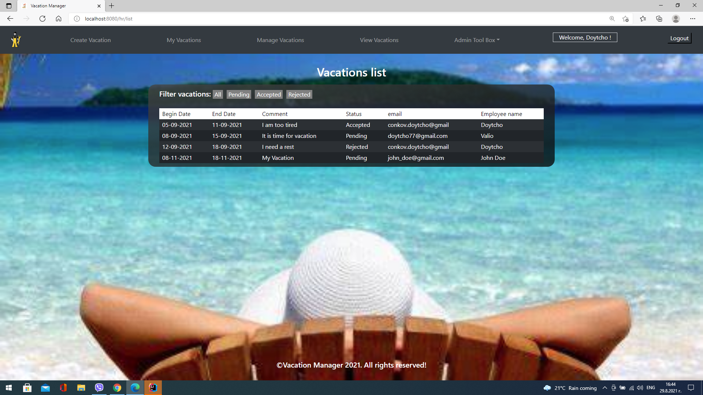
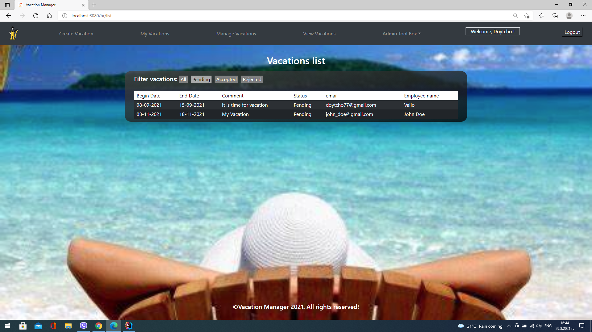

A check is made at the initial start of the project whether there are roles in the database and if not they are loaded. 

The first registered user receives administrator rights and can edit the roles of other users, such as: ADMIN, EMPLOYEE, MANAGER and HR. 

Upon registration, the rest of the users receive the EMPLOYEE role which can be changed by the administrator depending on the status of the user. 

An EMPLOYEE has authorization to create a vacation, see his/her vacations and cancel or edit them in case they have status PENDING. 

The MANAGER user has access to see all Vacations and accept and reject them respectively. The HR user sees  the vacations of all users and can filter them by status.

